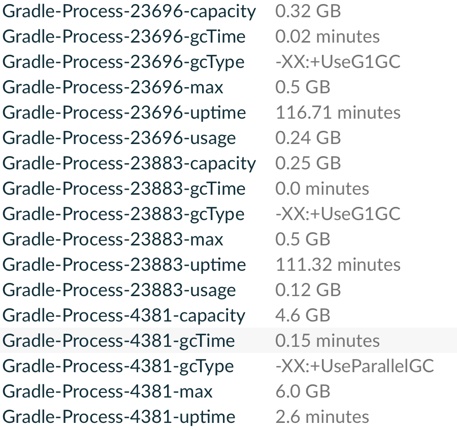

# Info Gradle Process Plugin
Includes information about Gradle processes in the Build Scans or in the build output.
The plugin is compatible with configuration cache.

> [!NOTE]
> Since version 0.3.1 the plugin is applied in `settings.gradle(.kts)` so process
> observation is configured once for the whole build (including multi-project builds).
> The legacy project-plugin id `io.github.cdsap.gradleprocess.project` remains available
> for migration; prefer the settings plugin for new usage.

## Usage
Apply the plugin in the main `settings.gradle(.kts)` configuration file:

#### Kotlin
``` kotlin
plugins {
  id("io.github.cdsap.gradleprocess") version "0.3.1"
}
```

#### Groovy
``` groovy
plugins {
  id "io.github.cdsap.gradleprocess" version "0.3.1"
}
```

### Project-plugin compatibility (legacy)
Consumers that still apply from a project build script can use the compatibility id
during migration:

#### Kotlin
``` kotlin
plugins {
  id("io.github.cdsap.gradleprocess.project") version "0.3.1"
}
```

#### Groovy
``` groovy
plugins {
  id "io.github.cdsap.gradleprocess.project" version "0.3.1"
}
```

## Output
### Build Scans
If you are using Develocity, the information about the Gradle processes will be included as custom value in the
Build Scan:



The field `Usage` represents the value obtained at the end of the build using `jstat` on the JVM process.

> [!NOTE]
Develocity 2024.2 provides new resource usage endpoints with detailed information about the different build and child processes during the execution:
https://docs.gradle.com/develocity/api-manual/ref/2024.2.html#tag/Builds/operation/GetGradleResourceUsage

### Build Output
If you are not using Develocity, the information about the Gradle processes will be included at the end of the build:
```
> Task :core:ui:compileProdDebugKotlin
┌─────────────────────────────────────────────────────────────────────────────┐
│  Gradle processes                                                           │
├─────────┬──────────┬───────────┬────────────┬───────────────┬───────────────┤
│  PID    │  Max     │  Usage    │  Capacity  │  GC Time      │  Uptime       │
├─────────┼──────────┼───────────┼────────────┼───────────────┼───────────────┤
│  10865  │  1.0 Gb  │  0.66 Gb  │  1.0 Gb    │  0.0 minutes  │  0.0 minutes  │
├─────────┼──────────┼───────────┼────────────┼───────────────┼───────────────┤
│  9011   │  0.5 Gb  │  0.2 Gb   │  0.5 Gb    │  0.0 minutes  │  0.0 minutes  │
└─────────┴──────────┴───────────┴────────────┴───────────────┴───────────────┘
BUILD SUCCESSFUL in 35s

```

## Requirements
* Gradle 7.5+

## Libraries
* `com.gradle:develocity-gradle-plugin`
* `com.jakewharton.picnic:picnic`
